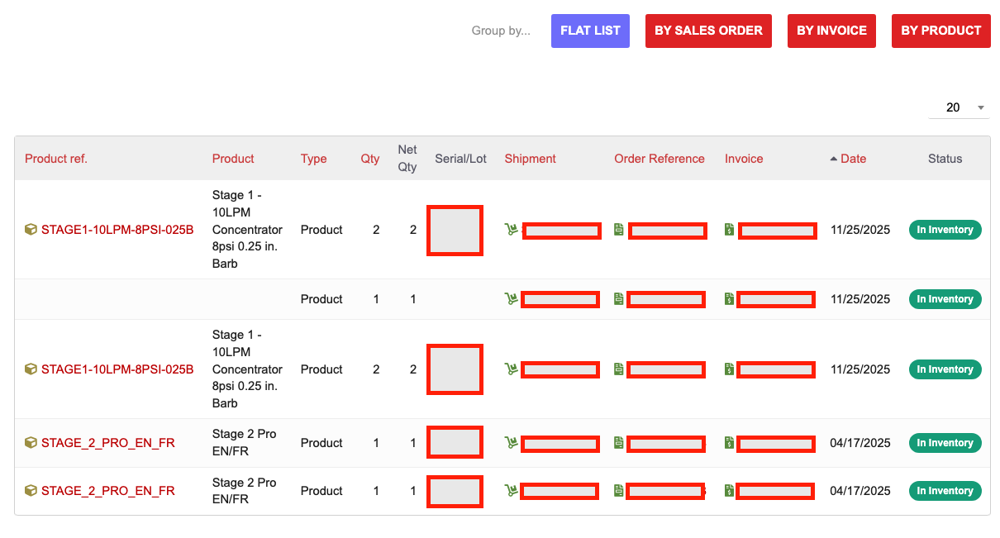

# Customer Inventory -- Customer Inventory Tab for Dolibarr

**Version 1.1.1** | [GitHub Repository](https://github.com/zacharymelo/dolibarr-customer-inventory) | License: GPL-3.0

## Overview

Customer Inventory adds a dedicated tab to third-party (customer) cards in Dolibarr, giving you a single view of every product that has been shipped to a customer. See serial numbers, lot numbers, quantities, and return statuses at a glance -- no report building or SQL queries required.

## Screenshots

**Customer Inventory Tab**

## Features

- **Customer Inventory tab** on every third-party card with a **badge count** showing the total number of inventory items
- **Flat and grouped views** -- see data as a flat list, or group by Sales Order, Invoice, or Product using the buttons at the top of the tab
- **Sortable columns** -- click any column header to sort by product reference, serial number, quantity, date, and more
- **Serial and lot number display** for each shipment line, with per-serial quantities for batch-tracked items
- **Multiple invoice links per row** -- when a single order spans multiple invoices, all invoice links appear together
- **Return status badges** (when Customer Returns module is active): color-coded In Inventory, Returned, or Partial Return badges on each line
- **Net quantity calculation** -- automatically subtracts returned quantities so you always see the real number on hand

## Requirements

| Requirement | Details |
|---|---|
| Dolibarr | Version 16 or higher |
| PHP | Version 7.0 or higher |
| **Required modules** | Third Parties, Products, Shipments |
| **Optional modules** | Customer Returns (enables return status badges and net quantity) |

## Installation

1. Download the latest `.zip` file from the [GitHub Releases](https://github.com/zacharymelo/dolibarr-customer-inventory/releases) page
2. Log in to your Dolibarr instance as an administrator
3. Navigate to **Home > Setup > Modules/Applications**
4. Click the **Deploy external module** button at the top of the page
5. Upload the `.zip` file you downloaded
6. Find "Customer Inventory" in the module list and click the toggle to **enable** it

**Zero configuration required.** There is no admin setup page for this module. Once enabled, the tab is immediately available on all third-party cards.

## Usage Guide

### Viewing Customer Inventory

1. Navigate to **Third Parties** in the Dolibarr left-hand menu
2. Open any customer's card
3. Click the **Customer Inventory** tab -- the badge on the tab shows how many items this customer has

The tab displays a table of all products that have been shipped to this customer. Each row represents a shipment line and shows the product reference and label, quantity, serial or lot number (if applicable), shipment reference, sales order reference, and invoice reference(s). All references are clickable links that take you directly to the corresponding record in Dolibarr.

### Switching Views

Use the group-by buttons at the top of the inventory list to change how the data is organized:

- **Flat List** -- every shipment line on its own row, no grouping
- **By Sales Order** -- lines grouped under the sales order they belong to
- **By Invoice** -- lines grouped under the invoice they were billed on
- **By Product** -- all deliveries of the same product collected together

The view you select takes effect immediately. Column sorting works within any view -- click a column header to sort ascending, click again to reverse.

### Understanding Return Status Badges

When the Customer Returns module is installed and enabled, each inventory line displays a color-coded status badge:

- **In Inventory** (green) -- the product is with the customer and has not been returned
- **Returned** (red) -- the full quantity has been returned
- **Partial Return** (orange) -- some but not all of the quantity has been returned

A net quantity column also appears, showing the shipped quantity minus any returned quantity. Without Customer Returns installed, these badges and the net quantity column are simply not displayed.

## Optional Integrations

### Customer Returns

Install the [Customer Returns](https://github.com/zacharymelo/doli-returns) module alongside Customer Inventory to see return status badges and net quantity on each inventory line. This gives your team instant visibility into which items are still with the customer and which have been returned.

## License

This module is licensed under the [GNU General Public License v3.0](https://www.gnu.org/licenses/gpl-3.0.html).
